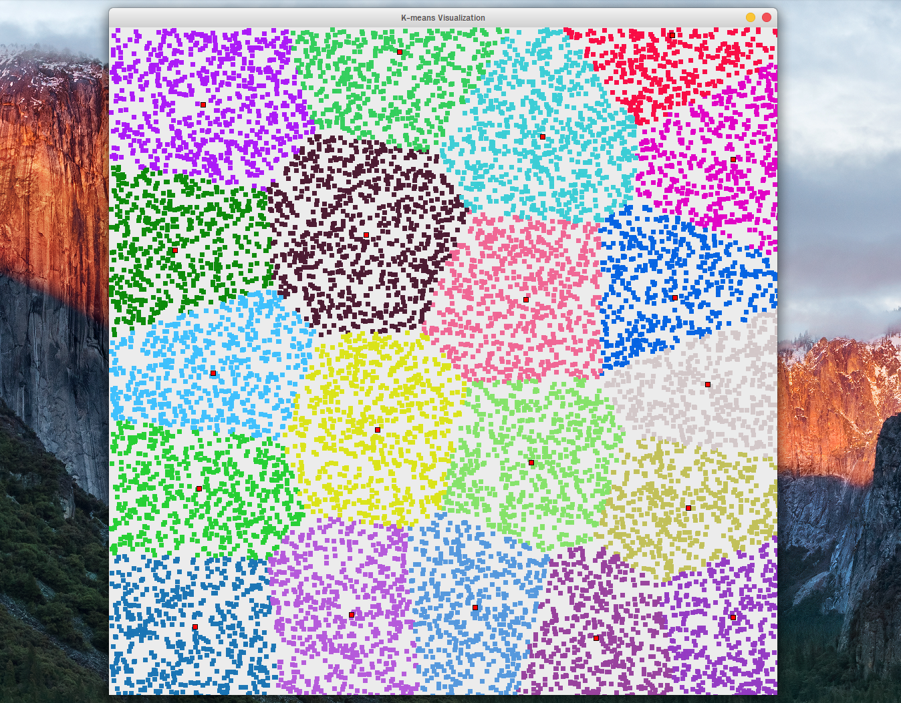
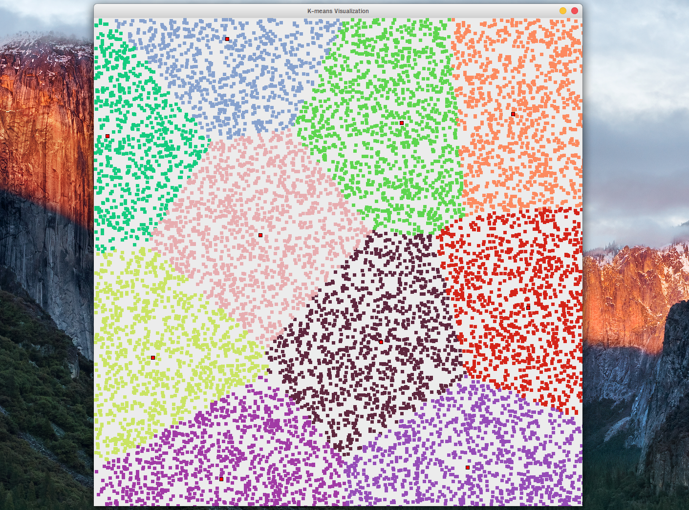

# K-means algorithm visualization
Realization and visualization of
[K-means clustering](https://en.wikipedia.org/wiki/K-means_clustering)
with Ruby and Qt.

## Installation
```bash
./setup.sh
```

## Running
```bash
./run.sh <point_number> <cluster_number>
```

## Examples
```./run.sh 10000 20```




```./run.sh 10000 10```


